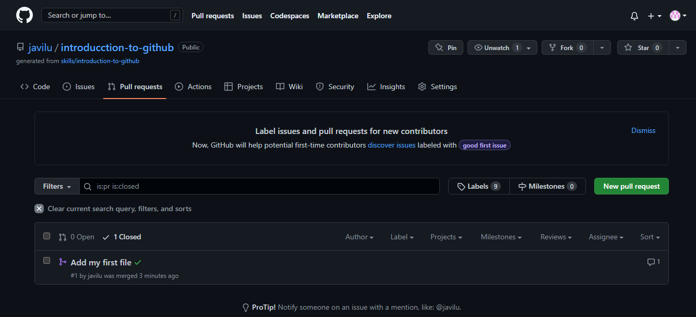

1. Busca en Wikipedia e indica:
    1. Qué es GitHub y su relación con Git
   
        Git es un ejemplo de VCS, y GitHub es un sitio web + infraestructura que proporciona un servidor Git más una serie de herramientas realmente útiles para trabajar con repositorios git individuales o en equipo, como informar problemas con el código, herramientas de revisión, características de administración de proyectos
    
    2. Compañía dueña de GitHub
   
        El 4 de junio de 2018 Microsoft compró GitHub por la cantidad de 7500 millones de dólares.

2. Qué es una rama en el código (branch of the code)

    Una rama o branch es una versión del código del proyecto sobre el que estás trabajando.

3. Qué es un pull request 
   
    Son la forma de contribuir a un proyecto grupal o de código abierto. Por ejemplo, un usuario llamado Harry realiza un fork de un repositorio de ThanoshanMV y le efectúa algunos cambios

4. Qué es un merge

    El comando git merge permite tomar las líneas independientes de desarrollo creadas por git branch e integrarlas en una sola rama. Ten en cuenta que todos los comandos presentados a continuación se fusionan en la rama actual.

5. Qué es un issue

    Un Issue es una nota en un repositorio que trata de llamar la atención sobre un problema. Puede ser un error a corregir, una petición para añadir una nueva opción o característica, una pregunta para aclarar algún tema que no está correctamente aclarado o muchas otras cosas diferentes.

6. Qué es una mención y qué implica

    Notificar a una persona en GitHub con "@" antes de su nombre de usuario. Los usuarios de una organización en GitHub también pueden formar parte de un equipo que se puede mencionar.

7. Qué es una etiqueta (label) y por qué su uso

    GitHub ofrece etiquetas predeterminadas en cada repositorio nuevo. Puede usar estas etiquetas predeterminadas para facilitar la creación de un flujo de trabajo estándar en un repositorio.

8.  Qué son las notificaciones. Indica las tres opciones de notificaciones

    Las notificaciones proporcionan actualizaciones sobre las actividades de a las que te hayas suscrito. Puedes usar la bandeja de entrada de notificaciones para personalizar, evaluar y administrar las actualizaciones.

9.  Qué son GitHub Pages

    GitHub Pages es un servicio de alojamiento de sitio estático que toma archivos HTML, CSS y JavaScript directamente desde un repositorio en GitHub, opcionalmente ejecuta los archivos a través de un proceso de complilación y publica un sitio web.

10. Qué es GitHub Flow

    GitHub Flow se define como un sistema de flujo de trabajo que se centra en los procesos de ramificación y que permite realizar implementaciones regulares en los proyectos, contribuyendo así a garantizar la entrega continua. Esta herramienta se basa en ramas o branches que forman parte del flujo de trabajo diario.

